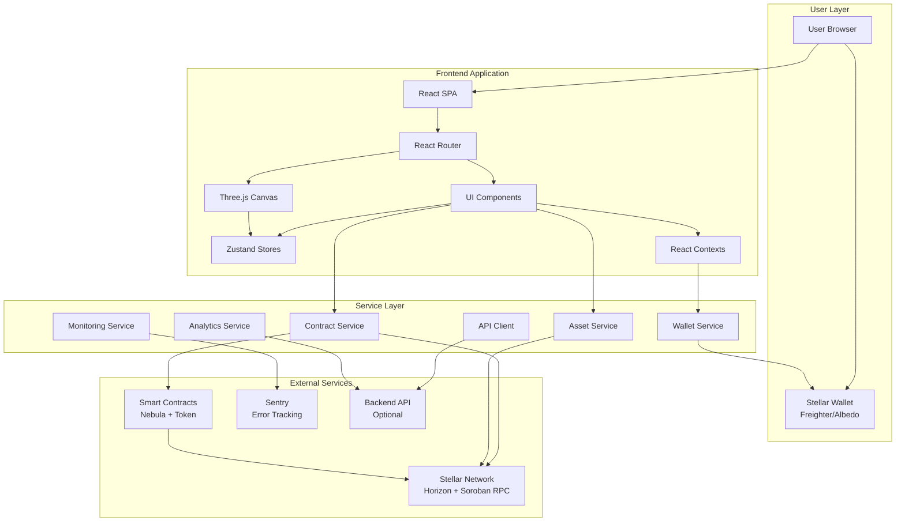
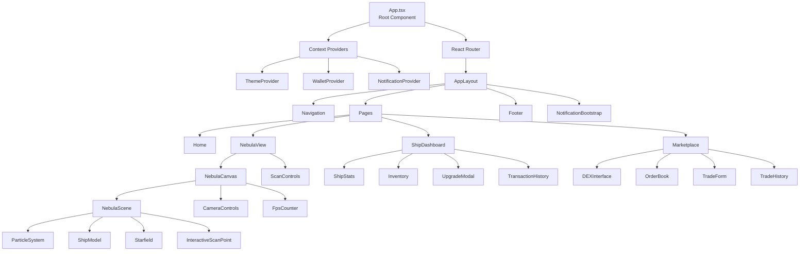
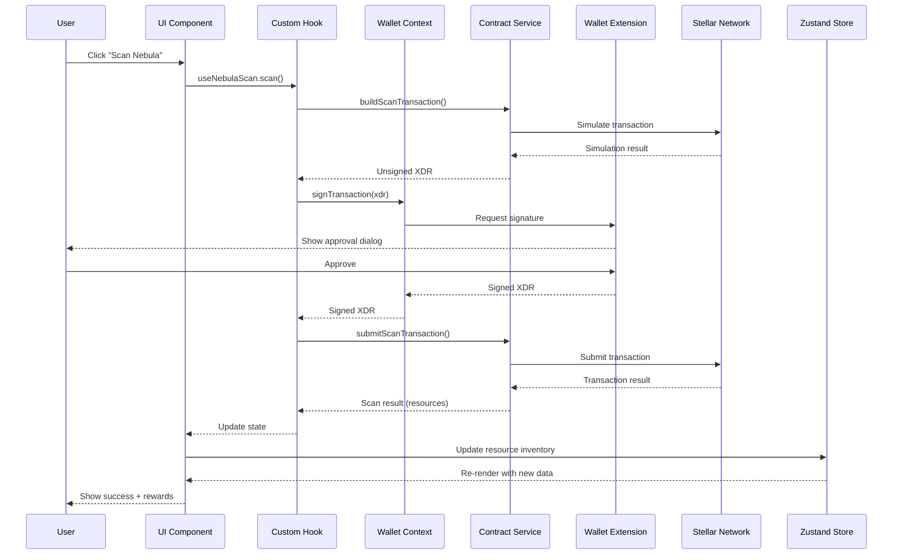
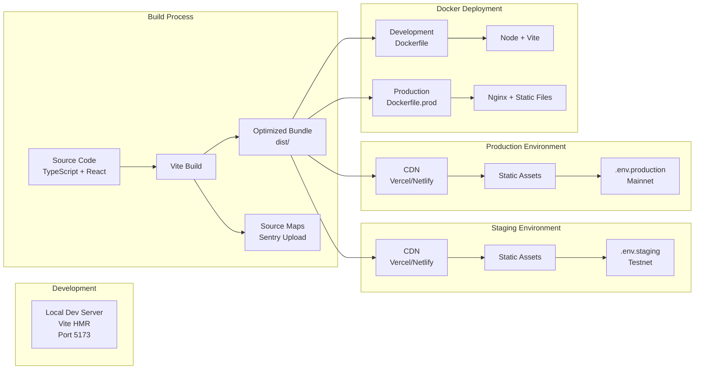

# Architecture Documentation

## Table of Contents

1. [System Overview](#system-overview)
2. [Architecture Diagrams](#architecture-diagrams)
3. [Component Relationships](#component-relationships)
4. [Data Flow](#data-flow)
5. [Technology Choices](#technology-choices)
6. [Deployment Architecture](#deployment-architecture)
7. [Patterns and Conventions](#patterns-and-conventions)

---

## System Overview

**Stellar Nebula Frontend** is a decentralized space exploration game built on the Stellar blockchain. The application provides an immersive, browser-based experience where users can:

- Connect their Stellar wallets (Freighter or Albedo)
- Explore procedurally generated nebulae rendered in 3D
- Scan cosmic anomalies and harvest resources as on-chain assets
- Upgrade their NFT spaceships using harvested resources
- Trade resources on Stellar's decentralized exchange (DEX)
- Track achievements and view leaderboards

The frontend is a **single-page application (SPA)** built with React and TypeScript, leveraging Three.js for 3D graphics and the Stellar SDK for blockchain interactions. It communicates with Soroban smart contracts deployed on Stellar's network (testnet, futurenet, or mainnet) to execute game logic transparently and verifiably on-chain.

### Key Characteristics

- **Client-side rendering**: All rendering happens in the browser; no server-side rendering (SSR)
- **Web3-native**: Direct wallet integration with transaction signing in the browser
- **Real-time 3D graphics**: WebGL-based rendering using Three.js and React Three Fiber
- **Mobile-first**: Responsive design optimized for touch interactions
- **Modular architecture**: Clear separation between UI, state management, blockchain services, and 3D rendering

---

## Architecture Diagrams

### High-Level System Structure



### Component Hierarchy



### Data Flow Architecture



### Deployment Architecture



---

## Component Relationships

### Core Application Structure

The application follows a layered architecture with clear separation of concerns:

#### 1. **Entry Point & Providers** (`src/App.tsx`)

The root component initializes the application and wraps it with essential context providers:

- **ThemeProvider**: Manages dark/light theme state with localStorage persistence
- **ErrorBoundary**: Catches and handles React component errors gracefully
- **WalletProvider**: Manages wallet connection state, transaction signing, and auto-reconnection
- **RouterProvider**: Handles client-side routing with React Router v6

The providers are ordered intentionally: Theme → Error Boundary → Wallet → Router, ensuring that theme is available first, errors are caught at the highest level, wallet state is accessible throughout, and routing happens within the wallet context.

#### 2. **Routing Layer** (`src/routes/index.tsx`)

Uses React Router v6 with lazy-loaded route components for code splitting:

- **Home** (`/`): Landing page with game introduction and wallet connection
- **NebulaView** (`/nebula`): Main 3D exploration interface
- **ShipDashboard** (`/dashboard`): Ship stats, inventory, and upgrade interface
- **Marketplace** (`/marketplace`): DEX trading interface for resources
- **NotFound** (`/*`): 404 fallback

All routes are wrapped in `<Suspense>` with a custom `LoadingScreen` component that provides thematic loading states. Route changes are tracked automatically via `RouteChangeTracker` for analytics and monitoring.

#### 3. **Layout Components** (`src/layouts/AppLayout.tsx`)

The `AppLayout` component provides the consistent shell for all pages:

- **Navigation**: Top navigation bar with wallet status and page links
- **Main Content Area**: `<Outlet>` for route-specific content
- **Footer**: App version, links, and network status
- **NotificationBootstrap**: Initializes the notification system

The layout handles the wallet reconnection state, showing a loading screen while attempting to restore the previous session.

#### 4. **Page Components** (`src/pages/`)

Each page is a self-contained feature module:

- **Home**: Marketing content, feature highlights, and primary CTA (Connect Wallet)
- **NebulaView**: The core game experience with 3D canvas and scan interactions
- **ShipDashboard**: Ship management, resource inventory, and upgrade flows
- **Marketplace**: Trading interface with order book, trade form, and history

Pages compose smaller UI components and connect to state via hooks and contexts.

#### 5. **UI Components** (`src/components/`)

Components are organized by feature domain:

- **Canvas/**: Three.js rendering components (NebulaCanvas, NebulaScene, CameraControls, FpsCounter)
- **Wallet/**: Wallet connection UI (ConnectModal, WalletDisplay, StatusIndicator)
- **Ship/**: Ship-related UI (UpgradeModal)
- **Resources/**: Resource management (Inventory)
- **Marketplace/**: Trading UI (DEXInterface, OrderBook, TradeForm, TradeHistory)
- **Achievements/**: Achievement system (AchievementCard, AchievementList, AchievementNotification)
- **Notifications/**: Notification center and toast system
- **Settings/**: User preferences panel
- **Tutorial/**: Onboarding tutorial flow
- **Loading/**: Loading states and screens
- **UI/**: Shared primitives (Spinner, buttons, modals)

Components follow atomic design principles, with smaller components composed into larger feature components.

#### 6. **State Management** (`src/store/`)

Uses Zustand for client-side state with localStorage persistence:

- **gameStore**: Game phase, current nebula, active operations, scan cooldowns
- **shipStore**: Ship inventory, active ship, ship stats
- **resourceStore**: Resource balances (cached from blockchain)
- **settingsStore**: User preferences (graphics quality, sound, network)
- **userStore**: User profile and session data
- **tutorialStore**: Tutorial progress and completion state
- **sessionStore**: Session-specific ephemeral state
- **graphicsStore**: Graphics settings and performance metrics

Stores are persisted selectively—only stable data is saved to localStorage, while transient state (like loading flags) is excluded.

#### 7. **Context Providers** (`src/contexts/`)

React contexts provide global state for cross-cutting concerns:

- **WalletContext**: Wallet connection state, signing functions, network info
- **ThemeContext**: Dark/light theme toggle
- **NotificationContext**: In-app notification queue and management

Contexts are used for state that needs to be accessed deeply in the component tree without prop drilling.

#### 8. **Custom Hooks** (`src/hooks/`)

Hooks encapsulate reusable logic:

- **Contract Hooks** (`hooks/contracts/`):
  - `useNebulaScan`: Scan nebula zones via Soroban contract
  - `useShipUpgrade`: Build and execute ship upgrade transactions
  
- **Utility Hooks**:
  - `useDebounce`: Debounce rapid state changes
  - `useLocalStorage`: Sync state with localStorage
  - `useFreighterWallet`: Freighter-specific wallet operations
  - `useSignTransaction`: Transaction signing abstraction
  - `useTouchGestures`: Touch gesture detection for mobile
  - `useNebulaZoom`: Camera zoom controls for 3D canvas
  - `useFrameRateMonitor`: FPS tracking for performance monitoring
  - `useRenderResourceTracker`: WebGL resource usage tracking

Hooks follow the "one responsibility" principle and are composable.

#### 9. **Service Layer** (`src/services/`)

Services encapsulate external integrations and complex business logic:

- **wallets/**: Wallet adapter implementations (Freighter, Albedo)
- **contracts/**: Soroban contract interaction (transaction building, simulation, submission)
- **assets/**: Asset fetching and caching (resources, NFTs)
- **nft/**: NFT metadata fetching and parsing
- **stellar/**: Stellar SDK utilities (network config, account operations)
- **history/**: Transaction history fetching
- **api.ts**: HTTP client with retry logic and interceptors
- **analytics.ts**: Event tracking with PII sanitization
- **monitoring.ts**: Sentry and LogRocket integration
- **logging.ts**: Structured logging with scoped loggers
- **errorTracking.ts**: Error capture and reporting
- **sync.ts**: Background data synchronization
- **websocket.ts**: WebSocket client for real-time updates

Services are stateless and testable, accepting dependencies as parameters.

---

## Data Flow

### User Interaction Lifecycle

The application follows a unidirectional data flow pattern:

```
User Action → UI Event → Hook/Service → External API → State Update → UI Re-render
```

### Example: Scanning a Nebula

1. **User clicks "Scan" button** in NebulaView
2. **UI component** calls `useNebulaScan` hook's `scan()` function
3. **Hook** calls `SorobanContractClient.buildScanTransaction()` service method
4. **Service** constructs transaction parameters and simulates via Stellar RPC
5. **Service** returns unsigned XDR to hook
6. **Hook** calls `WalletContext.signTransaction()` with XDR
7. **Context** invokes wallet extension (Freighter/Albedo) to request user signature
8. **Wallet extension** shows approval dialog to user
9. **User approves** transaction in wallet
10. **Wallet** returns signed XDR to context
11. **Context** returns signed XDR to hook
12. **Hook** calls `SorobanContractClient.submitScanTransaction()` with signed XDR
13. **Service** submits transaction to Stellar network and polls for result
14. **Stellar network** executes contract, mints resources, returns result
15. **Service** parses result and returns scan data (resources earned)
16. **Hook** updates local state with result
17. **UI component** receives updated state and triggers re-render
18. **Component** updates Zustand store with new resource balances
19. **Store** persists to localStorage and notifies subscribers
20. **UI** shows success message and updated inventory

### Data Sources

The application fetches data from multiple sources:

#### Blockchain Data (Stellar Network)

- **Horizon API**: Account balances, transaction history, asset information
- **Soroban RPC**: Contract simulation, transaction submission, contract state queries
- **Smart Contracts**: Game logic execution (scan, upgrade, mint)

Blockchain data is the source of truth for:
- Wallet balances
- NFT ownership
- Resource assets
- Transaction history
- Contract state

#### Local Storage

Persisted client-side for offline access and performance:
- User preferences (theme, graphics quality, sound)
- Game state (current nebula, scan cooldowns)
- Ship inventory (cached from blockchain)
- Tutorial progress
- Wallet connection state (for auto-reconnect)

#### Backend API (Optional)

The application can optionally connect to a backend API for:
- Leaderboard data
- Analytics aggregation
- Metadata caching
- Social features

The backend is not required for core gameplay—all critical operations happen on-chain.

### State Synchronization

The application maintains consistency between blockchain state and local state:

1. **Optimistic Updates**: UI updates immediately on user action, then confirms with blockchain
2. **Polling**: Periodically fetches fresh data from Stellar (every 5 seconds for active operations)
3. **Event Listening**: WebSocket connection for real-time contract events (optional)
4. **Cache Invalidation**: Clears cached data after mutations (scan, upgrade, trade)
5. **Reconciliation**: Compares local state with blockchain state and resolves conflicts

### Error Handling Flow

Errors are handled at multiple levels:

```
Error Occurs → Service Catches → Hook Receives → UI Displays → Monitoring Captures
```

- **Service Layer**: Catches network errors, retries transient failures, returns structured error objects
- **Hook Layer**: Receives errors, updates error state, logs to console
- **UI Layer**: Displays user-friendly error messages via toast notifications
- **Monitoring Layer**: Captures errors in Sentry with context (user, transaction, network)

---

## Technology Choices

### Core Framework: React 19

**Why React?**
- **Component-based architecture**: Encourages reusable, testable UI components
- **Large ecosystem**: Extensive library support for Web3, 3D graphics, and UI
- **Stellar SDK compatibility**: Official Stellar SDK works seamlessly with React
- **Developer experience**: Excellent tooling, hot module replacement, and debugging

**Why React 19?**
- **Concurrent rendering**: Improves responsiveness during heavy 3D rendering
- **Automatic batching**: Reduces unnecessary re-renders in state-heavy game UI
- **Transitions API**: Smooth loading states for async operations (wallet signing, blockchain queries)

### Language: TypeScript 5.9

**Why TypeScript?**
- **Type safety**: Catches errors at compile time, especially critical for blockchain transactions
- **Better IDE support**: Autocomplete and inline documentation for Stellar SDK
- **Refactoring confidence**: Safe refactoring of complex state management and service layers
- **Self-documenting code**: Types serve as inline documentation for contract interfaces

### Build Tool: Vite 7

**Why Vite?**
- **Fast HMR**: Instant hot module replacement for rapid development
- **Optimized bundling**: Rollup-based production builds with tree-shaking
- **Native ESM**: Leverages browser-native ES modules for faster dev server
- **Plugin ecosystem**: Excellent React and TypeScript support out of the box

### State Management: Zustand

**Why Zustand over Redux/Context?**
- **Minimal boilerplate**: No actions, reducers, or providers—just hooks
- **Excellent TypeScript support**: Fully typed stores with inference
- **Persistence built-in**: First-class localStorage middleware
- **Performance**: Selective subscriptions prevent unnecessary re-renders
- **Small bundle size**: ~1KB vs Redux's ~10KB

Zustand is ideal for this application because game state is relatively simple (ship stats, resources, settings) and doesn't require complex middleware or time-travel debugging.

### Routing: React Router 6

**Why React Router?**
- **Declarative routing**: Routes defined as React components
- **Code splitting**: Lazy loading with `React.lazy()` and `Suspense`
- **Nested routes**: Clean layout composition with `<Outlet>`
- **Type-safe navigation**: TypeScript support for route parameters

### 3D Graphics: Three.js + React Three Fiber

**Why Three.js?**
- **WebGL abstraction**: Simplifies complex WebGL programming
- **Performance**: Hardware-accelerated 3D rendering
- **Extensive ecosystem**: Loaders, helpers, and post-processing effects
- **Mobile support**: Works on mobile browsers with WebGL support

**Why React Three Fiber?**
- **React integration**: Three.js objects as React components
- **Declarative 3D**: Easier to reason about scene composition
- **Hooks for animation**: `useFrame` for render loop, `useThree` for scene access
- **Automatic cleanup**: React lifecycle handles Three.js object disposal

This combination allows the nebula visualization to be performant (60 FPS on mid-range devices) while remaining maintainable.

### Styling: Tailwind CSS

**Why Tailwind?**
- **Utility-first**: Rapid UI development without context switching
- **Consistent design system**: Predefined spacing, colors, and breakpoints
- **Tree-shaking**: Unused styles are purged in production
- **Dark mode**: Built-in dark mode support with `dark:` prefix
- **Mobile-first**: Responsive design by default

Tailwind is well-suited for this project because the UI is component-heavy and benefits from consistent spacing and responsive utilities.

### Blockchain: Stellar SDK

**Why Stellar?**
- **Low fees**: Transactions cost ~0.00001 XLM (~$0.000001), enabling micro-transactions
- **Fast finality**: 5-second block times for near-instant confirmations
- **Built-in DEX**: Native decentralized exchange for resource trading
- **Soroban smart contracts**: Turing-complete contracts with Rust-like safety
- **Asset issuance**: Easy creation of custom tokens (resources, NFTs)

**Why Stellar SDK?**
- **Official library**: Maintained by Stellar Development Foundation
- **Comprehensive**: Covers Horizon, Soroban RPC, transaction building, and signing
- **TypeScript support**: Fully typed for safe blockchain interactions

### Testing: Vitest + Testing Library

**Why Vitest?**
- **Vite-native**: Shares config with Vite, no separate setup
- **Fast**: Parallel test execution with instant HMR
- **Jest-compatible**: Familiar API for developers coming from Jest
- **ESM support**: Works with native ES modules

**Why Testing Library?**
- **User-centric**: Tests focus on user behavior, not implementation details
- **Accessibility**: Encourages accessible component design
- **React integration**: `@testing-library/react` for component testing

### Monitoring: Sentry + LogRocket

**Why Sentry?**
- **Error tracking**: Captures unhandled errors with stack traces
- **Performance monitoring**: Tracks slow transactions and API calls
- **Session replay**: Records user sessions leading to errors
- **Breadcrumbs**: Logs user actions for debugging context

**Why LogRocket?**
- **Advanced session replay**: Records DOM, network, and console logs
- **User analytics**: Tracks user behavior and conversion funnels
- **Integration with Sentry**: Links sessions to error reports

These tools are essential for debugging blockchain interactions, which can fail in non-obvious ways (network issues, contract errors, wallet rejections).

### Analytics: Custom Event Tracker

**Why custom analytics?**
- **Privacy-first**: No third-party tracking scripts (GDPR-compliant)
- **PII sanitization**: Automatically removes sensitive data (wallet addresses, keys)
- **Opt-out support**: Users can disable analytics via settings
- **Lightweight**: ~2KB vs Google Analytics' ~50KB

The custom tracker sends events to an optional backend endpoint, allowing the team to analyze user behavior without compromising privacy.

### Deployment: Docker + Vercel/Netlify

**Why Docker?**
- **Consistency**: Same environment across dev, staging, and production
- **Isolation**: Dependencies are containerized
- **Multi-stage builds**: Separate dev and production images

**Why Vercel/Netlify?**
- **Zero-config deployment**: Automatic builds on git push
- **Global CDN**: Fast asset delivery worldwide
- **Preview deployments**: Every PR gets a unique URL
- **Environment variables**: Secure config management

---

## Deployment Architecture

### Build Process

The application uses a multi-stage build process:

1. **Development Build** (`npm run dev`)
   - Vite dev server with HMR
   - Source maps enabled
   - No minification
   - Runs on `localhost:5173`

2. **Production Build** (`npm run build`)
   - TypeScript compilation (`tsc -b`)
   - Vite production build (Rollup)
   - Minification and tree-shaking
   - Source map generation
   - Sentry source map upload (if configured)
   - Output to `dist/` directory

### Environment Configuration

The application supports three environments:

#### Development (`.env.local`)
- **Network**: Testnet
- **Monitoring**: Disabled
- **Dev tools**: Enabled (FPS counter, performance monitor)
- **Logging**: Debug level

#### Staging (`.env.staging`)
- **Network**: Futurenet
- **Monitoring**: Enabled (Sentry, LogRocket)
- **Dev tools**: Enabled
- **Logging**: Info level

#### Production (`.env.production`)
- **Network**: Mainnet
- **Monitoring**: Enabled
- **Dev tools**: Disabled
- **Logging**: Warn level

Environment variables are validated at startup (`src/config/env.ts`). Missing required variables throw an error with a helpful message.

### Docker Deployment

#### Development Container (`Dockerfile`)
```dockerfile
FROM node:18-alpine
WORKDIR /app
COPY package*.json ./
RUN npm install
COPY . .
EXPOSE 5173
CMD ["npm", "run", "dev", "--", "--host"]
```

- **Base image**: Node 18 Alpine (lightweight)
- **Hot reloading**: Volume-mounted source code
- **Port**: 5173 (Vite default)

#### Production Container (`Dockerfile.prod`)
```dockerfile
# Stage 1: Build
FROM node:18-alpine AS build
WORKDIR /app
COPY package*.json ./
RUN npm install
COPY . .
RUN npm run build

# Stage 2: Serve
FROM nginx:stable-alpine
COPY --from=build /app/dist /usr/share/nginx/html
EXPOSE 80
CMD ["nginx", "-g", "daemon off;"]
```

- **Multi-stage**: Build stage + serve stage
- **Nginx**: Serves static files with gzip compression
- **Port**: 80 (HTTP)

### CDN Deployment (Vercel/Netlify)

1. **Connect repository** to Vercel/Netlify
2. **Configure build settings**:
   - Build command: `npm run build`
   - Output directory: `dist`
   - Node version: 18
3. **Set environment variables** in dashboard
4. **Deploy**: Automatic on push to `main` branch

### Deployment Flow

```
Developer Push → GitHub → CI/CD Pipeline → Build → Deploy → CDN
```

1. Developer pushes to `main` branch
2. GitHub triggers webhook to Vercel/Netlify
3. CI/CD pipeline runs:
   - Install dependencies
   - Run linter (`npm run lint`)
   - Run tests (`npm test`)
   - Build production bundle (`npm run build`)
   - Upload source maps to Sentry
4. Deploy to CDN
5. Invalidate cache
6. Notify team (Slack, Discord)

### Performance Optimization

The production build includes several optimizations:

- **Code splitting**: Routes are lazy-loaded
- **Tree-shaking**: Unused code is removed
- **Minification**: JavaScript and CSS are minified
- **Compression**: Gzip/Brotli compression enabled
- **Asset optimization**: Images are optimized, fonts are subsetted
- **Caching**: Aggressive caching with cache-busting hashes

### Monitoring and Observability

Production deployments include:

- **Error tracking**: Sentry captures errors with source maps
- **Performance monitoring**: Sentry tracks slow transactions
- **Session replay**: LogRocket records user sessions
- **Analytics**: Custom event tracking for user behavior
- **Logging**: Structured logs with scoped loggers

---

## Patterns and Conventions

### Code Organization

The codebase follows a feature-based organization:

```
src/
├── components/       # UI components (by feature)
├── contexts/         # React contexts
├── hooks/            # Custom hooks
├── services/         # External integrations
├── store/            # Zustand stores
├── pages/            # Route components
├── layouts/          # Layout components
├── config/           # Configuration
├── constants/        # Constants
├── types/            # TypeScript types
├── utils/            # Utility functions
└── assets/           # Static assets
```

### Component Patterns

#### 1. **Functional Components with Hooks**

All components are functional components using hooks:

```typescript
export function MyComponent({ prop }: MyComponentProps) {
  const [state, setState] = useState(initialState)
  const value = useCustomHook()
  
  return <div>{/* JSX */}</div>
}
```

#### 2. **Props Interface**

Every component has a typed props interface:

```typescript
interface MyComponentProps {
  title: string
  onAction: () => void
  optional?: boolean
}
```

#### 3. **Compound Components**

Related components are grouped:

```typescript
export function Card({ children }: CardProps) {
  return <div className="card">{children}</div>
}

Card.Header = function CardHeader({ children }: CardHeaderProps) {
  return <div className="card-header">{children}</div>
}

Card.Body = function CardBody({ children }: CardBodyProps) {
  return <div className="card-body">{children}</div>
}
```

### State Management Patterns

#### 1. **Zustand Store Pattern**

Stores follow a consistent structure:

```typescript
interface MyState {
  data: Data[]
  isLoading: boolean
}

interface MyActions {
  fetchData: () => Promise<void>
  updateData: (id: string, data: Data) => void
}

type MyStore = MyState & MyActions

export const useMyStore = create<MyStore>()(
  persist(
    (set, get) => ({
      data: [],
      isLoading: false,
      fetchData: async () => {
        set({ isLoading: true })
        const data = await api.fetchData()
        set({ data, isLoading: false })
      },
      updateData: (id, data) => {
        set((state) => ({
          data: state.data.map((item) =>
            item.id === id ? data : item
          ),
        }))
      },
    }),
    {
      name: 'my-store',
      storage: createJSONStorage(() => localStorage),
    }
  )
)
```

#### 2. **Context Pattern**

Contexts provide global state:

```typescript
interface MyContextValue {
  state: State
  actions: Actions
}

const MyContext = createContext<MyContextValue | null>(null)

export function MyProvider({ children }: MyProviderProps) {
  const [state, setState] = useState(initialState)
  
  const value = useMemo(() => ({
    state,
    actions: { /* ... */ },
  }), [state])
  
  return <MyContext.Provider value={value}>{children}</MyContext.Provider>
}

export function useMyContext() {
  const context = useContext(MyContext)
  if (!context) {
    throw new Error('useMyContext must be used within MyProvider')
  }
  return context
}
```

### Service Layer Patterns

#### 1. **Service Functions**

Services are stateless functions:

```typescript
export async function fetchData(
  params: Params,
  config?: Config
): Promise<Result> {
  const response = await api.get('/endpoint', params)
  return parseResponse(response)
}
```

#### 2. **Error Handling**

Services throw typed errors:

```typescript
export class ServiceError extends Error {
  constructor(
    message: string,
    public code: string,
    public status: number
  ) {
    super(message)
    this.name = 'ServiceError'
  }
}

export async function fetchData(): Promise<Result> {
  try {
    const response = await api.get('/endpoint')
    return response.data
  } catch (error) {
    throw new ServiceError(
      'Failed to fetch data',
      'FETCH_ERROR',
      500
    )
  }
}
```

#### 3. **Retry Logic**

Services implement retry for transient failures:

```typescript
export async function fetchWithRetry<T>(
  fn: () => Promise<T>,
  retries = 3
): Promise<T> {
  let lastError: Error
  
  for (let i = 0; i < retries; i++) {
    try {
      return await fn()
    } catch (error) {
      lastError = error as Error
      if (i < retries - 1) {
        await delay(1000 * Math.pow(2, i))
      }
    }
  }
  
  throw lastError!
}
```

### Hook Patterns

#### 1. **Data Fetching Hook**

```typescript
export function useData(id: string) {
  const [data, setData] = useState<Data | null>(null)
  const [isLoading, setIsLoading] = useState(false)
  const [error, setError] = useState<string | null>(null)
  
  const fetch = useCallback(async () => {
    setIsLoading(true)
    setError(null)
    
    try {
      const result = await fetchData(id)
      setData(result)
    } catch (err) {
      setError(err instanceof Error ? err.message : 'Unknown error')
    } finally {
      setIsLoading(false)
    }
  }, [id])
  
  useEffect(() => {
    fetch()
  }, [fetch])
  
  return { data, isLoading, error, refetch: fetch }
}
```

#### 2. **Action Hook**

```typescript
export function useAction() {
  const [isLoading, setIsLoading] = useState(false)
  const [error, setError] = useState<string | null>(null)
  
  const execute = useCallback(async (params: Params) => {
    setIsLoading(true)
    setError(null)
    
    try {
      const result = await performAction(params)
      return result
    } catch (err) {
      const message = err instanceof Error ? err.message : 'Unknown error'
      setError(message)
      return null
    } finally {
      setIsLoading(false)
    }
  }, [])
  
  return { execute, isLoading, error }
}
```

### Error Handling Conventions

#### 1. **Error Boundaries**

Top-level error boundary catches React errors:

```typescript
export class ErrorBoundary extends Component<Props, State> {
  static getDerivedStateFromError(error: Error) {
    return { hasError: true, error }
  }
  
  componentDidCatch(error: Error, errorInfo: ErrorInfo) {
    captureError(error, errorInfo)
  }
  
  render() {
    if (this.state.hasError) {
      return <ErrorFallback error={this.state.error} />
    }
    return this.props.children
  }
}
```

#### 2. **Toast Notifications**

User-facing errors are shown via toast:

```typescript
try {
  await performAction()
  toast.success('Action completed')
} catch (error) {
  toast.error(error instanceof Error ? error.message : 'Action failed')
}
```

#### 3. **Logging**

All errors are logged with context:

```typescript
try {
  await performAction()
} catch (error) {
  log.error('Action failed', error as Error, { context: 'additional info' })
  throw error
}
```

### Testing Conventions

#### 1. **Component Tests**

```typescript
describe('MyComponent', () => {
  it('renders correctly', () => {
    render(<MyComponent prop="value" />)
    expect(screen.getByText('value')).toBeInTheDocument()
  })
  
  it('handles user interaction', async () => {
    const onAction = vi.fn()
    render(<MyComponent onAction={onAction} />)
    
    await userEvent.click(screen.getByRole('button'))
    expect(onAction).toHaveBeenCalled()
  })
})
```

#### 2. **Hook Tests**

```typescript
describe('useMyHook', () => {
  it('fetches data', async () => {
    const { result } = renderHook(() => useMyHook())
    
    await waitFor(() => {
      expect(result.current.data).toBeDefined()
    })
  })
})
```

#### 3. **Service Tests**

```typescript
describe('myService', () => {
  it('fetches data successfully', async () => {
    const data = await fetchData()
    expect(data).toEqual(expectedData)
  })
  
  it('handles errors', async () => {
    await expect(fetchData()).rejects.toThrow('Error message')
  })
})
```

### Naming Conventions

- **Components**: PascalCase (`MyComponent.tsx`)
- **Hooks**: camelCase with `use` prefix (`useMyHook.ts`)
- **Services**: camelCase (`myService.ts`)
- **Stores**: camelCase with `Store` suffix (`myStore.ts`)
- **Types**: PascalCase (`MyType.ts`)
- **Constants**: UPPER_SNAKE_CASE (`MY_CONSTANT`)
- **Functions**: camelCase (`myFunction`)
- **Variables**: camelCase (`myVariable`)

### File Structure Conventions

- **Index files**: Re-export public API (`index.ts`)
- **Test files**: Co-located with source (`MyComponent.test.tsx`)
- **Story files**: Co-located with component (`MyComponent.stories.tsx`)
- **Type files**: Separate file if shared (`types.ts`)

---

## Conclusion

This architecture document provides a comprehensive overview of the Stellar Nebula Frontend application. The system is designed for:

- **Maintainability**: Clear separation of concerns, consistent patterns
- **Scalability**: Modular architecture, code splitting, performance optimization
- **Reliability**: Error handling, monitoring, testing
- **Developer experience**: TypeScript, hot reloading, comprehensive tooling

For questions or contributions, see [CONTRIBUTING.md](CONTRIBUTING.md).
